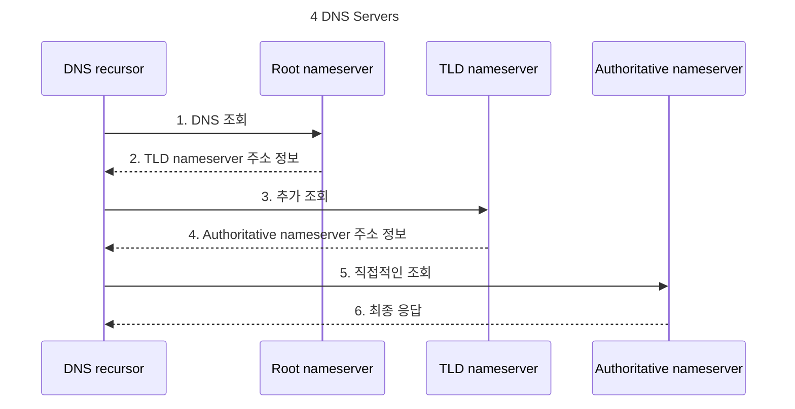

# DNS
> Domain Name System 域名系统 

### Table of Contents
- [Demystifing DNS](#demystifing-dns)

## Demystifing DNS 

DNS 에 대해 이해하려면 DNS query 와 관련된 다양한 하드웨어에 대해 알아야한다.  
DNS 와 관련된 서버는 네 종류가 존재하는데 DNS recursor, Root nameserver, TLD nameserver, 그리고 Authoritative nameserver 이다. 

각 서버의 역할에 따라 도서관에 비유하자면 DNS recursor 는 도서관 사서, Root nameserver 는 도서관의 색인, TLD nameserver 는 책꽃이, 그리고 Authoritative nameserver 는 찾고자하는 책에 해당한다고 볼 수 있다.
> Source of the Analogy : ["What is DNS? | How DNS Works" published on the Cloudflare Learning blog](https://www.cloudflare.com/learning/dns/what-is-dns/)

1. DNS recursor (`Librarian`)
   - 클라이언트로 부터 DNS 쿼리를 받는 서버.
1. Root nameserver (`Index`)
   - DNS 계층 구조의 가장 상위에 위치한 서버.
1. TLD nameserver (`Rack`)
   - 루트 네임서버로부터 받은 쿼리 처리.
   - 권한 네임 서버 주소 정보를 클라이언트에게 전송.
1. Authoritative nameserver (`Book`)
   - 특정 도메인의 DNS 정보를 관리하는 서버.

네 서버의 커뮤니케이션은 아래 다이아그램과 같이 순차적으로 일어난다.

1. `DNS Recursor` → `Root Nameserver`
   - (요청된 도메인 정보가 포함된) DNS 쿼리 전송
1. `DNS Recursor` ⇠ `Root Nameserver`
   - 요청 받은 쿼리 처리
   - TLD Nameserver 정보 검색
   - 찾은 정보 제공
1. `DNS Recursor` → `TLD Nameserver`
   - (요청된 도메인 정보가 포함된) DNS 쿼리 전송
1. `DNS Recursor` ⇠ `TLD Nameserver`
   - 요청 받은 쿼리 처리
   - Authoritative Nameserver 정보 검색
   - 찾은 정보 제공
1. `DNS Recursor` → `Authoritative Nameserver`
   - 직접 (요청된 도메인 정보가 포함된) DNS 쿼리 전송
1. `DNS Recursor` ⇠ `Authoritative Nameserver`
   - 요청 받은 쿼리 처리
   - DNS 정보 검색
   - 찾은 정보 제공
